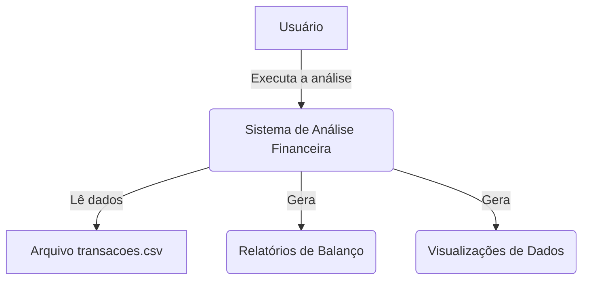

# 1. Analise Sistema Financeiro

**Disciplina:** Programação para Ciência de Dados
**Curso:** MBA Ciência de Dados UNIFOR 
**Instrutor:** Cássio Pinheiro 

**Integrantes:**
Pedro Milton de Sousa Rebouças

**Repositório GitHub:** 
**Data de Entrega:** 14/11/2025

---

## 2. Objetivo do Projeto

O objetivo deste projeto é realizar uma análise completa de um conjunto de dados de transações financeiras. A partir de um arquivo `transacoes.csv`, o sistema processa, valida e analisa os dados para gerar um balanço financeiro mensal, separando receitas e despesas. O projeto visa consolidar os conhecimentos dos Módulos 1, 2 e 3, aplicando desde a manipulação de dados com Pandas até a geração de visualizações com Matplotlib/Seaborn.

* **Problema que resolve:** Fornece uma visão clara do fluxo de caixa mensal, identificando meses com lucro ou prejuízo.
* **Contexto de aplicação:** Gestão financeira pessoal ou de pequenas empresas.

## 3. Diagrama de Contexto (Mermaid)

O diagrama abaixo ilustra a arquitetura C4 de contexto do sistema:


# 4. Funcionalidades Implementadas
(Módulo 1, 2) Carregamento de Dados: Leitura e parsing do arquivo transacoes.csv para um DataFrame do Pandas.
(Módulo 1) Validação de Dados: Verificação básica dos tipos de transação (limitado a 'RECEITA', 'DESPESA') e modos de pagamento.
(Módulo 1, 2) Preparação de Dados: Conversão da coluna 'data' para o formato datetime e extração do mês para agrupamento.
(Módulo 2) Cálculo de Receitas: Agrupamento e soma das transações de 'RECEITA' por mês.
(Módulo 2) Cálculo de Despesas: Agrupamento e soma das transações de 'DESPESA' por mês.
(Módulo 2) Cálculo de Balanço Mensal: Junção (merge) dos DataFrames de receita e despesa para calcular o saldo (Receita - Despesa) de cada mês.

# 5. Estrutura de Dados

```
Dados de Entrada: Um arquivo transacoes.csv  com as seguintes colunas:
    tipo: (str) 'RECEITA' ou 'DESPESA'
    descricao: (str) Descrição da transação
    valor: (float) Valor da transação
    data: (str/datetime) Data da transação
    modo: (str) Código do banco/modo de pagamento
    Beneficiario: (str) Beneficiário da transação
    Balanço Mensal (DataFrame):
    Mês: (int)
    Receita: (float)
    Despesa: (float)
    Saldo: (float)
```

# 6. Requisitos Técnicos

```
Python: 3.9+ 
Bibliotecas (Dependências): 
pandas
matplotlib 
seaborn 
Instalação: As dependências podem ser instaladas via requirements.txt:
    pip install -r requirements.txt
```
# 7. Como Executar o Projeto
    - 7.1 Clone o repositório:
        git clone [SEU_LINK_DO_REPOSITORIO]
        cd Sistema_Financeiro
    - 7.2 Instale as dependências:
        pip install -r requirements.txt
    - 7.3 execute o script principal:
        python main.py
    - 7.4 Os relatórios e visualizações serão gerados na pasta relatorios/ ou exibidos.

# 8. Análises Realizadas

As análises implementadas (conforme o notebook) focam na consolidação financeira mensal:

Agrupamento por Tipo: Os dados foram filtrados e divididos em dois DataFrames principais: receitas_df e despesas_df.

Consolidação Mensal: Usando groupby('Mês'), calculamos o sum() e mean() dos valores para receitas e despesas separadamente.

Balanço Final: O pd.merge foi usado para unificar os totais mensais de receita e despesa em uma única tabela, permitindo o cálculo do Saldo (Receita - Despesa) para cada mês.

# 9. Estrutura do Projeto
O projeto segue a estrutura de diretórios recomendada :

```
nome_projeto/
├── README.md
├── requirements.txt
├── main.py                <-- (Script principal com a lógica)
├── dados/
│   └── transacoes.csv     <-- (Dataset de entrada)
├── src/
│   └── (Módulos Python, ex: validacao.py, calculos.py)
└── relatorios/
    └── (Gráficos e saídas salvas, ex: balanco_mensal.png)
```

# 10. Capturas de Tela / Exemplos de Saída
Exemplo da saída do DataFrame de Balanço Mensal gerado:

```
Balanço Mensal Completo:
    Mês      Receita      Despesa       Saldo
0     1  27477414.26  31063025.40 -3585611.14
1     2  32775686.74  34520174.65 -1744487.91
2     3  24588937.85  26955415.18 -2366477.33
3     4  27492936.56  33702586.85 -6209650.29
4     5  37189195.38  43356228.45 -6167033.07
5     6  35117891.87  36194586.69 -1076694.82
6     7  43122193.10  40027116.77  3095076.33
7     8  36230578.01  35394004.10   836573.91
8     9  45211418.86  44068303.22  1143115.64
9    10  19359510.73  19121855.81   237654.92
10   11  19116306.52  19703782.77  -587476.25
11   12  24787895.97  22100204.79  2687691.18
```

# 11. Testes Realizados
Os seguintes cenários foram validados:

    10.1 Validação de Tipo: O sistema verifica se o campo tipo contém 'RECEITA' ou 'DESPESA' (implementação básica do notebook).
    10.2 Validação de Modo: O sistema verifica se o modo está na lista de bancos/modos pré-aprovados (implementação básica do notebook).

# 12. Referências e Bibliografia
Documentação oficial do Pandas.
Documentação oficial do Matplotlib e Seaborn.
Dataset transacoes.csv (fonte interna do projeto).

# 13. Contribuições dos Integrantes

Pedro Rebouças: Responsável por todas as etapas do projeto, incluindo análise de requisitos, implementação dos cálculos (Módulo 2), estruturação do código (Módulo 1) e geração de visualizações (Módulo 3).

# 14. Próximos Passos / Melhorias Futuras
Melhorar Tratamento de Erros: Implementar um tratamento de exceções robusto (Módulo 1).
Expandir Análises: Criar novas análises, como Top 10 Beneficiários com mais despesas ou receitas por modo.
Novas Visualizações: Adicionar gráficos de pizza para a distribuição de despesas por categoria (requereria engenharia de features na 'descricao').